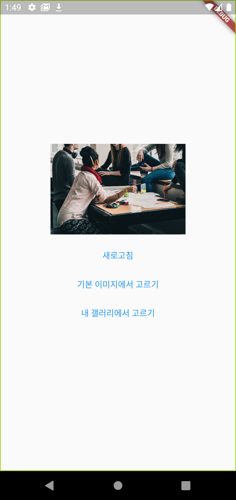
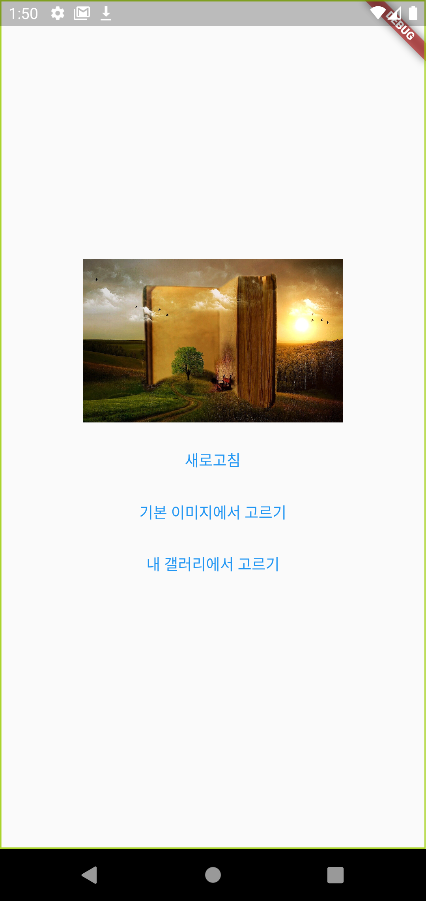
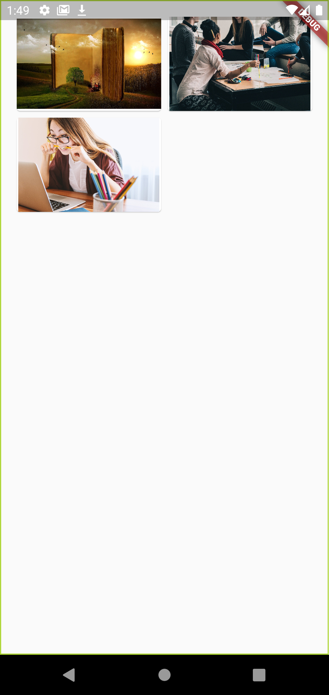
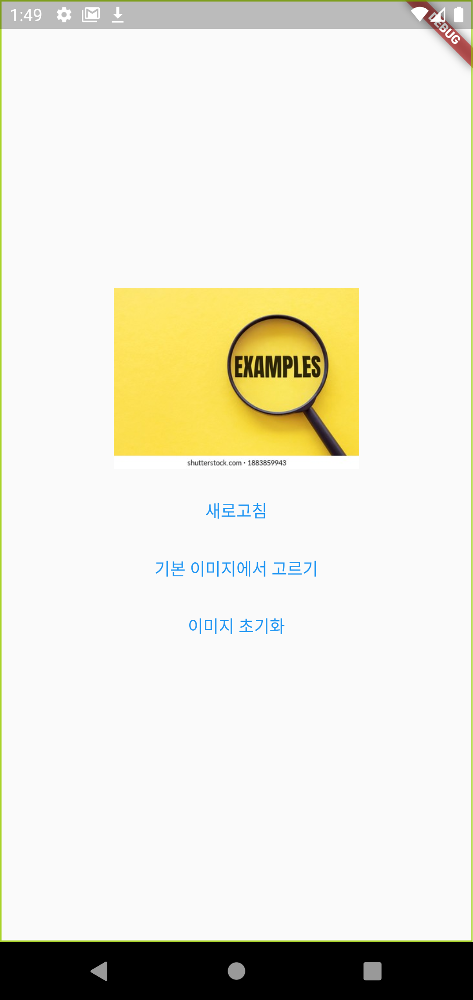

# ramdom_image
앱 내에 있는 이미지를 랜덤하게 불러오고 새로고침 시 새로운 이미지가 나옴.  
갤러리에 있는 이미지를 불러왔을 때에도 초기화 버튼으로 초기화.

## 새로고침

## 기본 이미지 불러오기

## 갤러리에서 불러오기 (갤러리에서 불러올 시 `갤러리에서 불러오기` 버튼이 `이미지 초기화` 버튼으로 바뀜

## 갤러리 이미지 초기화

